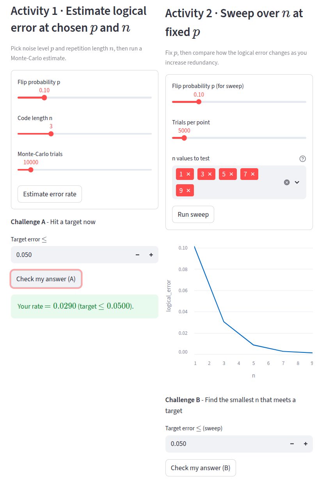

# Quantum Stepping Stones

This repository is meant to document my learning of Quantum Error Correction through coding exercises.

Learners who have a grasp of basic quantum information theory can use it to complement their own learning journey.

**Update**:</b> I am developing this into a web app made using [Streamlit](https://streamlit.io/). This is a work in progress, which aims to create a  set of interactive learning exercises to help understand Quantum Error Correction. 
[**Click here to visit the current version of the web app.**](https://aquetzalcoatlus-quantum-stepping-stones-app-tyrl1b.streamlit.app/)

# References

The resources I intend to use:

1. [Quantum Error Correction: An Introductory Guide by Roffe](http://arxiv.org/abs/1907.11157)
2. [The Bible of Quantum Computing](https://www.cambridge.org/highereducation/books/quantum-computation-and-quantum-information/01E10196D0A682A6AEFFEA52D53BE9AE#overview)
3. [Blog posts of Arthur Pesah](https://arthurpesah.me/blog/2022-01-25-intro-qec-1/)

**Author**: Karthik Jayadevan
